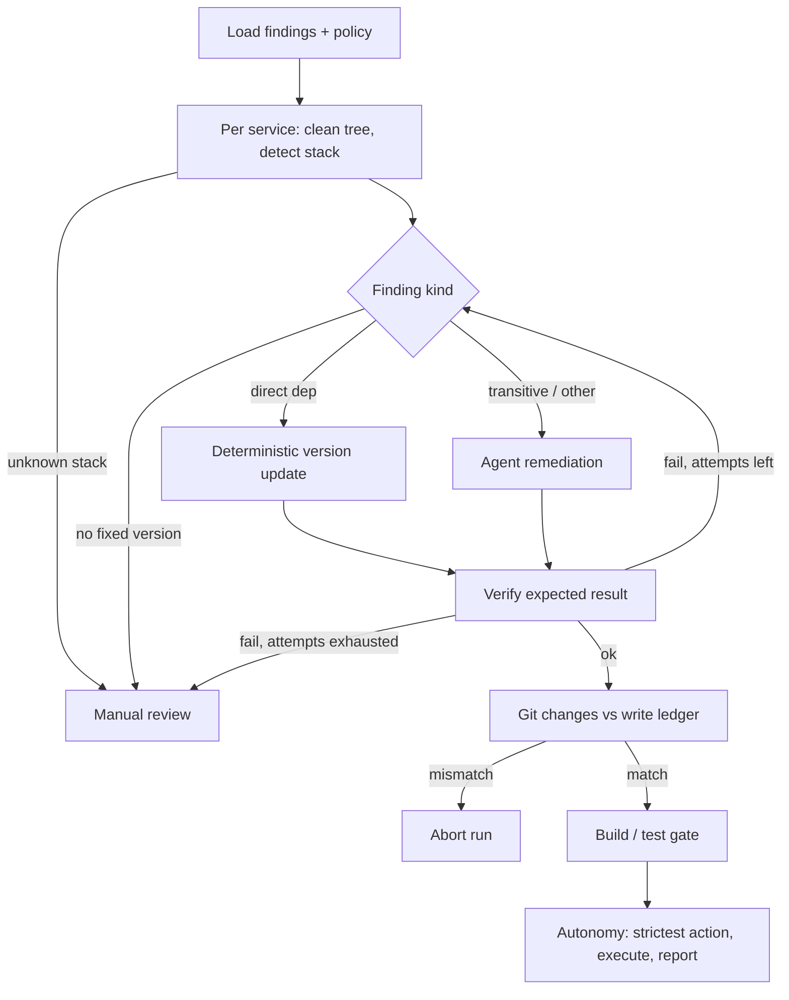

# Security Harness Design

The harness remediates vulnerability findings one service at a time. Its goal is to make narrowly scoped fixes while preserving evidence, verification, and a human escape hatch whenever safety or confidence is insufficient.

## Workflow

1. Load findings and policy from `guards.yaml`, `build-gate.yaml`, and `autonomy.yaml`; group findings by service.
2. For each service, require a clean Git tree (unless change verification is explicitly disabled), then detect its configured stack from marker files. An unknown configured stack is sent to manual review before any change is made.
3. Process each finding sequentially. Direct dependencies receive a deterministic version update; transitive or otherwise non-direct findings are sent to the agent. A missing fixed version requires manual attention.
4. Each remediation is verified against its expected result. Direct updates must declare the fixed version; agent remediation must leave its per-CVE remediation marker. Failed verification or a failed per-attempt build can retry, but only up to the harness-owned attempt limit.
5. Before the service build gate runs, compare Git's changed paths with the toolbox write ledger. Any undeclared, missing, or pre-existing change aborts the run rather than treating it as a valid remediation.
6. Run the detected stack's ordered build/test commands. A blocking or manual-review build result makes the service require attention.
7. Evaluate autonomy rules for every completed finding, choose the strictest service-level action, execute that action, and write a run report when requested.

## Guards

- **Contained tools:** agent reads and writes are rooted in the service work directory; unsupported tools and paths outside that directory are refused.
- **Preflight policy:** every agent tool call is checked before any call is applied. The shipped rules route writes to Git metadata, credentials/secrets, and build-output directories to manual review.
- **Read-before-write:** requested reads run before writes. Content that appears to be prompt injection is refused and no writes are applied.
- **Test preservation:** after agent writes, the harness counts runnable tests in affected files. A reduced count is retained for review and requires manual attention.
- **Change accountability:** Git status must exactly match the paths recorded by the toolbox. Build output is excluded only when configured for the detected stack, and agent writes there are separately guarded.

## Autonomy logic

### Source Code Changes
At the beginning, while we are still building trust in the agent, all changes that touch source code must go through a human review via a pull request. During early stages metrics such as regression rate, human intervention rate, time to successful remediation and others should be measured.

### Minor and Patch Dependency Updates
Minor and patch dependency updates can be merged automatically when there are no source code changes and all builds pass.

### Major Framework Updates
Major updates to framework-related dependencies require a Jira ticket. A pull request may be created automatically, but the change requires human involvement due to the larger blast radius.

### Small Code Changes
For a given service, small code changes may be handled automatically when they do not affect critical parts of the application. This depends on the quality of testing for the affected packages, E2E test coverage, and how frequently regression testing is performed.

## Scaling
As an initial step in scaling the solution from 2 to 300 services, the harness should be run separately for each service repository. The target architecture should use containerized harness executions per service, orchestrated through workflows managed by a system such as n8n.